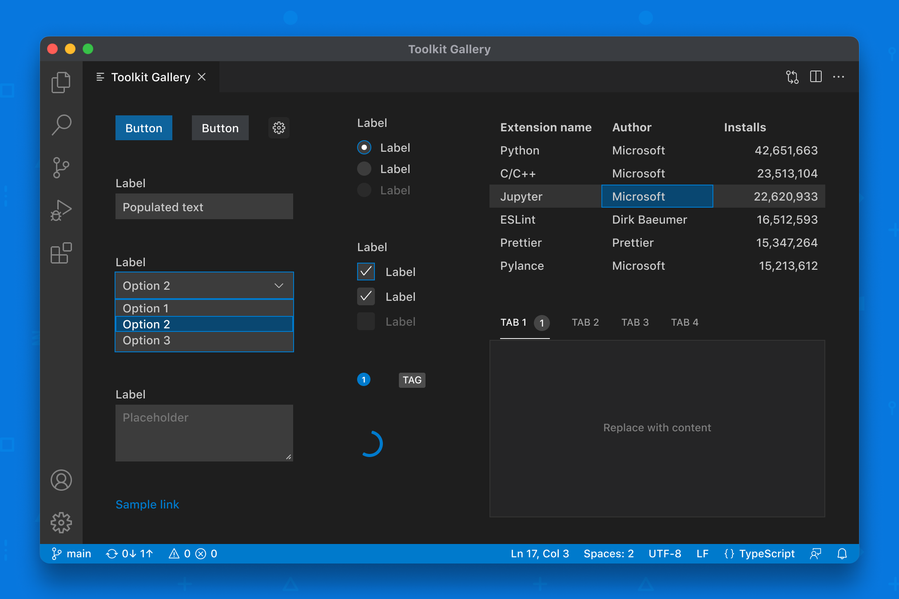

# DarBot Webview UI Toolkit

[](https://www.npmjs.com/package/darbot-webview-ui)
[](./LICENSE)


> **Unofficial and Unsupported Continuation**  
> This is an unofficial and unsupported continuation of the Microsoft vscode-webview-ui-toolkit, which was deprecated on January 1, 2025. This project aims to provide ongoing support and enhancements for webview-based extensions.



## Introduction

The DarBot Webview UI Toolkit is a component library for building webview-based extensions with support for VS Code, GitHub Copilot, and other editors that support webviews.

Some of the library's features include:

-   **Modern design language:** All components follow modern design principles with support for multiple editor themes.
-   **Automatic support for color themes:** All components are designed with theming in mind, and will automatically display the current editor theme.
-   **Tech stacks:** The library ships as a set of web components. This means developers can use the toolkit no matter which tech stack – React, Vue, Svelte, etc. – their extension is built with.
-   **Immediate accessibility:** All components ship with web-standard compliant ARIA labels and keyboard navigation.
-   **Latest dependencies:** Updated to support the latest versions of React, TypeScript, and build tools.

## Getting started

Follow the [Getting Started Guide](./docs/getting-started.md).

If you already have a webview-based extension, you can install the toolkit with the following command:

```
npm install --save darbot-webview-ui
```

## Documentation

For more information, check out the following documentation:

-   [Component Docs](./docs/components.md)
-   [Toolkit Extension Samples](https://github.com/darbotlabs/darbot-webview-ui-samples)
-   [Webview API Guide](https://code.visualstudio.com/api/extension-guides/webview)
-   [Webview API Guidelines](https://code.visualstudio.com/api/references/extension-guidelines#webviews)
-   [Webview UX Guidelines](https://code.visualstudio.com/api/ux-guidelines/webviews)
-   [Extension API Docs](https://code.visualstudio.com/api)
-   [Figma Toolkit](https://www.figma.com/community/file/1071566662997054792/Webview-UI-Toolkit-for-Visual-Studio-Code)

## A note on webview usage

Webviews are a powerful way to add custom functionality beyond what the standard editor APIs support. They're fully customizable, which, historically, has meant that the responsibility of developing UI which aligns with the editor's design language and follows webview guidelines lies in the hands of extension authors.

The DarBot Webview UI Toolkit shifts _some_ of this responsibility away from extension developers. It does this by providing core components that make it easier to build higher quality webview UIs for various editors including VS Code, GitHub Copilot, and others.

With all this said, we still strongly encourage you to carefully review whether or not your extension needs to use webviews before building. While webviews provide a great way to add custom functionality, oftentimes, they come at the cost of performance and accessibility.

Many editor APIs provide a vast array of building blocks for highly performant, accessible, and tightly integrated extension experiences. Generally, we encourage you to use them before webviews. If you haven't already, check out the API capabilities for your target editor to get an idea of what's possible.

Finally, if you're ever unsure if your extension should use webviews or not, you should open an issue and we'll give you some feedback and guidance.

## Contributing

Read the [contributing](./CONTRIBUTING.md) documentation.

## Legal notices

DarBot Labs and any contributors grant you a license to any code in the repository under the [MIT License](https://opensource.org/licenses/MIT), see the [LICENSE](LICENSE) file.

This project may contain trademarks or logos for projects, products, or services. Authorized use of Microsoft trademarks or logos is subject to and must follow [Microsoft’s Trademark & Brand Guidelines](https://www.microsoft.com/en-us/legal/intellectualproperty/trademarks). Use of Microsoft trademarks or logos in modified versions of this project must not cause confusion or imply Microsoft sponsorship. Any use of third-party trademarks or logos are subject to those third-party’s policies.

This project is an unofficial continuation of the Microsoft vscode-webview-ui-toolkit and is not affiliated with or endorsed by Microsoft Corporation. Use of any trademarks or logos must follow the respective trademark policies of their owners.

Any use of third-party trademarks or logos are subject to those third-party's policies.
